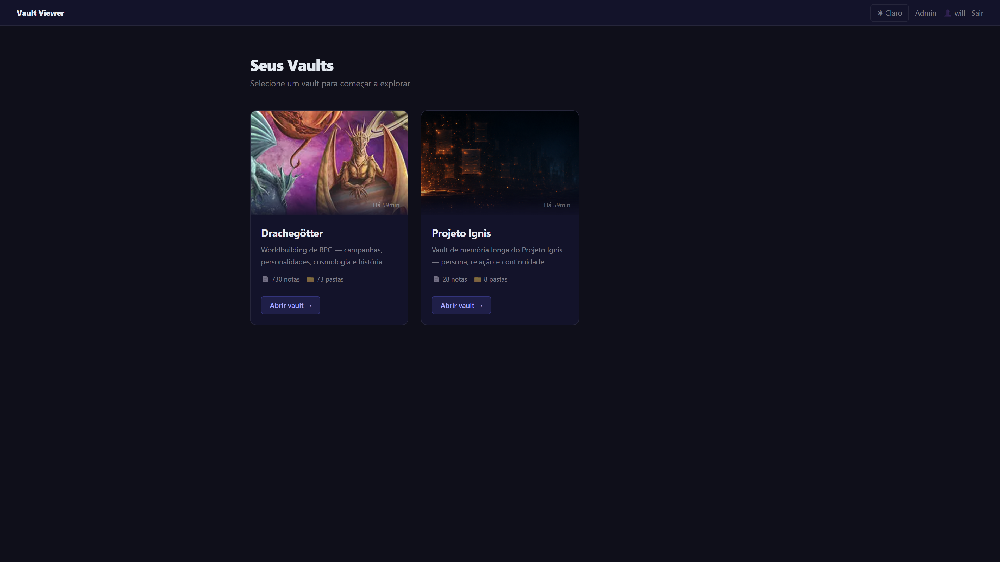
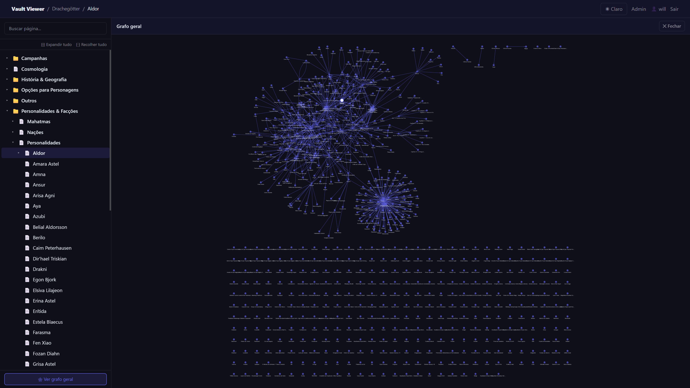
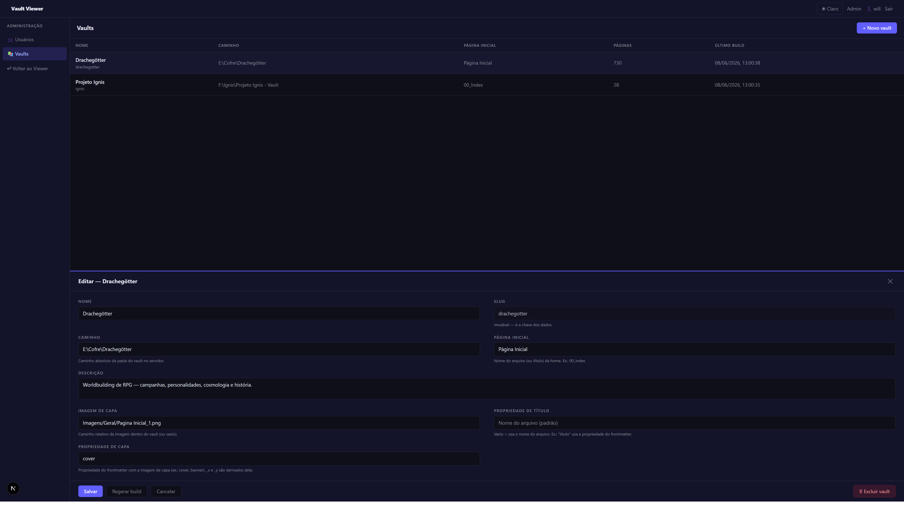

# Vault Viewer

[](LICENSE)
[](https://nextjs.org)
[](https://react.dev)
[](https://www.typescriptlang.org)
[](https://tailwindcss.com)
[](#adding-a-language)

A self-hosted, multi-vault, access-controlled viewer for [Obsidian](https://obsidian.md) vaults — built to render the plugins and syntax a real vault actually uses.

> **In short:** yet another Obsidian publish tool. It exists because the existing ones didn't cover my case: faithful rendering of the plugins I rely on, fully self-hosted, multiple vaults from one instance, and per-user access control.

---

## Why another one?

There are great tools for publishing Obsidian vaults — [Quartz](https://quartz.jzhao.xyz/) and [Digital Garden](https://dg-docs.ole.dev/) chief among them. I built this because I wanted **all** of the following at once:

- **Plugin/syntax compatibility** — banners, multi-column layouts, callouts (including custom ones), Dataview (DQL *and* DataviewJS), galleries, Mermaid, LaTeX, Canvas, etc. — rendered the way they look in Obsidian.
- **Self-hosted** — runs on my own machine/server, no third-party publishing service.
- **Multi-vault** — several vaults served from a single instance.
- **Per-user access control** — accounts with admin/reader roles and per-vault permissions.

**If that describes your case, make yourself at home.** If you just want a public, zero-auth digital garden, **Quartz** or **Digital Garden** will probably serve you better — they're more mature for that use case and don't carry the auth/multi-tenant machinery.

---

## What it does

### Obsidian compatibility (build-time rendering)

- **Banners / cover images** — configurable cover property per vault (`cover`, `banner`, …), with `_x`/`_y` focal position, fading smoothly into the page background.
- **Callouts** — foldable (`[!note]+/-`), markdown in titles (bold, links, headings), per-type colors/icons, custom types (e.g. `userinput`), and callouts nested inside blockquotes/columns.
- **Multi-column layouts** (` ```col / ```col-md `) with `flexGrow` and `textAlign`.
- **Dataview** — both **DQL** queries and **DataviewJS** (executed in a sandboxed mini-DOM at build time), including image galleries and cards. Dataview blocks work even when nested inside callouts/columns.
- **Mermaid** diagrams (rendered client-side) and **LaTeX** math (`$$…$$`, via KaTeX).
- **Wikilinks** — by filename *or* relative path, with aliases and heading anchors (`[[Page#Heading|alias]]`).
- **Canvas** (`.canvas`) — rendered as a responsive, positioned layout (text/file/image/group nodes).
- Image captions, `==highlights==`, Obsidian-permissive bold/italic, image embeds with `|width`, and more.

### Viewer UI

- **Three-panel layout**: collapsible file tree · content · graph/index/backlinks.
- **File tree** with search, expand/collapse-all, **Notion-style folder notes** (a folder with a same-named page acts as both folder and page), animated expand/collapse, and middle-click/ctrl-click to open in a new tab.
- **Folders open as auto-generated index pages** (a list of their contents) — handy on mobile.
- **Local graph** (current page + direct neighbors) and a full **global graph** of every page, both interactive (click a node to navigate).
- **Right panel** with collapsible sections: local graph, **table of contents**, and **backlinks** ("mentioned in"). Collapse state persists across navigation within a session.
- **Properties block** — a collapsible, Obsidian-style frontmatter table at the top of each page; wikilink values become links, image properties (e.g. `Galeria`) become clickable thumbnails.
- **Interactive Dataview tables** (filter + sort) and **Notion-style filters** for galleries.
- **Link hover previews** — internal links show a thumbnail + snippet; external links fetch Open Graph metadata (title/description/image/favicon).
- **Image lightbox**, dark/light theme, mobile drawers, and SPA navigation.
- **Localized UI** — ships with **English** and **Brazilian Portuguese (pt-BR)**, with a language switcher in the top bar. The browser language is used on first visit (falling back to English); the choice is then remembered per user. Adding a language is plug-and-play — see [Adding a language](#adding-a-language).

### Hosting & administration

- **Multiple vaults** from one instance, each with its own config.
- **Accounts** with admin/reader roles; **per-vault access** granted per user (admins see everything).
- **Admin panel** to manage users and vaults (create/edit/delete a vault, set its home page, cover/title property, and trigger rebuilds — all from the browser).
- **`.viewerignore`** (gitignore syntax) per vault to hide files/folders from the build.

---

## Screenshots

> Screenshots live in `docs/screenshots/`. (Replace the placeholders below with your own.)

| Vault list | Page with banner + properties |
| --- | --- |
|  |  |

| Global graph | Admin — vaults |
| --- | --- |
|  |  |

---

## Getting started

### Requirements

- **Node.js 20+**
- npm (or your package manager of choice)
- An Obsidian vault (a folder of `.md`/`.canvas` files) somewhere on disk

### 1. Install

```bash
git clone <your-repo-url> vault-viewer
cd vault-viewer
npm install
```

### 2. Configure the environment

Create `.env.local` (see `.env.local.example`):

```bash
# A long, random string used to sign session JWTs.
JWT_SECRET=replace-with-a-long-random-32+-char-string
```

> Generate one quickly: `node -e "console.log(require('crypto').randomBytes(32).toString('hex'))"`

### 3. Create the first admin user

The SQLite database (`users.db`) is created automatically on first use. Seed an admin:

```bash
npx tsx scripts/seed-admin.ts <username> <password>
# defaults to: admin / admin123  (change it after first login)
```

### 4. Register a vault

Vaults are described in `vaults.config.json` at the project root. This file is gitignored (it holds machine-specific absolute paths) — create it from the example:

```bash
cp vaults.config.example.json vaults.config.json
```

Then edit it **or** add vaults from the admin UI (step 6).

```jsonc
{
  "vaults": [
    {
      "slug": "my-vault",                 // URL-safe id; the data key — don't change it later
      "name": "My Vault",                 // display name
      "path": "C:\\Users\\me\\My Vault",  // absolute path to the vault folder on the server
      "description": "Notes about things.",
      "homePage": "00_Index",             // filename (or title) of the landing page
      "coverImage": "assets/banner.png",  // relative path to the card image (or null)
      "titleProperty": "title",           // optional: frontmatter property to use as page title
      "coverProperty": "cover"            // optional: frontmatter property holding the banner (cover/banner)
    }
  ]
}
```

> `path` is an absolute path on the machine running the app. `vaults.config.json` therefore contains machine-specific paths — consider keeping a `vaults.config.example.json` in git and gitignoring the real one if you share the repo.

### 5. Build a vault

Rendering happens ahead of time (build step), writing the output to `data/<slug>/` and copying images to `public/vault-assets/<slug>/`.

```bash
# Build one vault
npx tsx builder/index.ts --vault my-vault

# Build every vault in vaults.config.json
npx tsx builder/index.ts --all
```

Re-run this whenever the vault's content changes (or use the **Regenerate** button in the admin UI).

### 6. Run the app

Development:

```bash
npm run dev
# http://localhost:3000
```

Production:

```bash
npm run build
npm run start
```

Log in with the admin account you seeded. Admins see all vaults; create reader accounts and grant them per-vault access from the admin panel.

---

## Managing vaults

### From the admin UI (`/admin` → **Vaults**)

- **Create** a vault (name + absolute path; the slug is derived automatically).
- **Edit** name, path, description, home page, cover image, and the title/cover frontmatter properties.
- **Regenerate build** — runs the builder for that vault from the browser.
- **Delete** a vault (removes it from the config and its built data).

> The "Regenerate build" button spawns the builder process (`npx tsx builder/index.ts`); it works wherever `tsx` and the project are available (e.g. your dev/host machine).

### From the CLI

```bash
npx tsx builder/index.ts --vault <slug>   # one vault
npx tsx builder/index.ts --all            # all vaults
```

### Managing users

In `/admin` → **Users**: create reader/admin accounts, set passwords, and grant per-vault access. The first admin is created with the seed script above.

---

## Hiding files: `.viewerignore`

Drop a `.viewerignore` file at the **root of a vault** to exclude files/folders from the build. It uses the same syntax as `.gitignore`:

```gitignore
# Hide these from the viewer
CLAUDE.md
Templates/
**/*.private.md
!Templates/Public.md
```

Anything matched is excluded from pages, search, the graph, and link resolution.

---

## Per-vault display settings

- **`titleProperty`** — use a frontmatter property (e.g. `title`/`titulo`) as the page's display title instead of the filename. Useful when a note's heading differs from its filename. Falls back to the filename when the property is missing.
- **`coverProperty`** — which frontmatter property holds the banner image (`cover`, `banner`, …). The builder also reads `<prop>_x` / `<prop>_y` for the focal crop position.

Both can be set in `vaults.config.json` or via the admin UI.

---

## Adding a language

The UI ships with English (`en`) and Brazilian Portuguese (`pt-BR`). Translations live in `lib/i18n/` as one file per language — a flat dictionary of dotted keys → text. To add a language (no build tooling required):

1. **Copy** `lib/i18n/en.ts` to a new file, e.g. `lib/i18n/de.ts`, and rename the exported constant (e.g. `export const de = { ... }`).
2. **Translate** the values on the right-hand side only — keep the keys unchanged. Placeholders like `{username}`, `{count}`, `{name}` must stay as-is (they're interpolated at runtime); emojis included in some values (e.g. `🕸 View global graph`) can be kept or adjusted.
3. **Register** it in `lib/i18n/index.ts` by adding an entry to `LOCALES`:

   ```ts
   import { de } from './de'
   export const LOCALES: Locale[] = [
     { code: 'en', label: 'English', dict: en },
     { code: 'pt-BR', label: 'Português (BR)', dict: ptBR },
     { code: 'de', label: 'Deutsch', dict: de },   // ← new
   ]
   ```

That's it. The new language appears in the top-bar switcher automatically, and visitors whose browser asks for it (matched by exact code or primary subtag, e.g. `de-AT` → `de`) get it on first visit. Anything not yet translated falls back to the key's English/default value, so a partial translation still works. `DEFAULT_LOCALE` in the same file controls the fallback language.

## License

Licensed under [Creative Commons Attribution-NonCommercial 4.0 International (CC BY-NC 4.0)](https://creativecommons.org/licenses/by-nc/4.0/). See [`LICENSE`](LICENSE).

You are free to use, copy, share, and adapt this project **for non-commercial purposes**, as long as you give appropriate credit. Commercial use is not permitted without permission.

## Tech stack

Next.js (App Router) · React · TypeScript · Tailwind CSS · better-sqlite3 · jose (JWT) · unified/remark/rehype · KaTeX · Mermaid · cytoscape.

---

## Project layout

```
builder/      # ahead-of-time vault renderer (markdown → HTML, plugins, graph)
app/          # Next.js routes (viewer, admin, auth API)
components/   # viewer + admin React components
lib/          # auth, db, vault data loaders, helpers
data/         # build output per vault (gitignored)
scripts/      # seed-admin
vaults.config.json   # vault definitions
```
